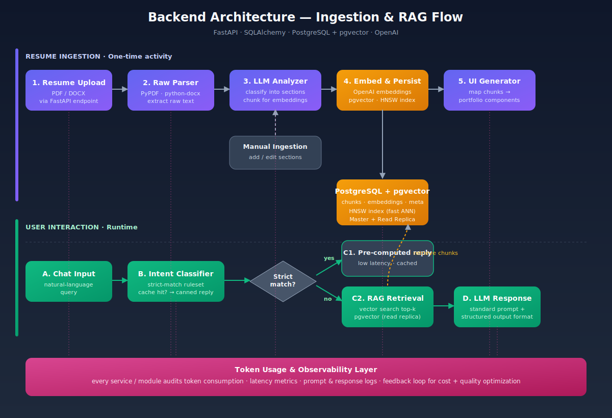
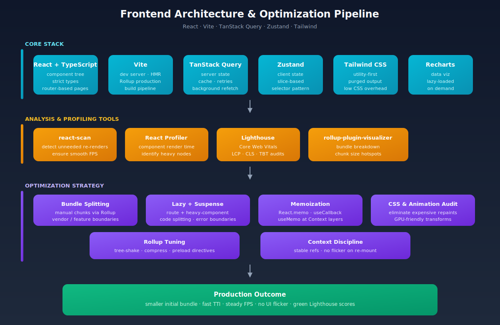
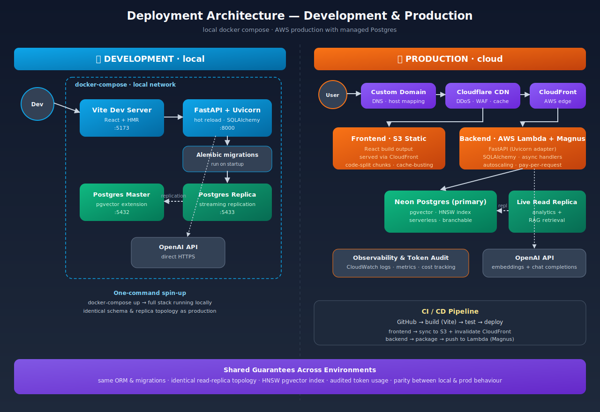

# AI-Powered Interactive Portfolio Platform - SmartFolio

> A dynamic developer portfolio that turns a raw resume into a conversational, recruiter-friendly experience — powered by Retrieval-Augmented Generation.

---

## 📖 Overview

An AI-driven portfolio platform that automatically transforms a raw resume into a dynamic, interactive developer profile. The system parses structured data from resumes (PDF/DOCX) and generates a fully integrated portfolio UI with an embedded conversational assistant that allows recruiters and visitors to explore experience, projects, and technical skills through natural language queries.

The platform leverages a **Retrieval-Augmented Generation (RAG)** pipeline to retrieve relevant professional context and produce accurate, context-aware responses in real time. The architecture combines modern frontend frameworks with a scalable backend and vector-based semantic search to deliver an intelligent, conversational representation of a developer's professional background.

---

## 🛠️ Technologies & Stack

### Frontend
- **Framework:** React (TypeScript) managed via Vite
- **Styling:** Tailwind CSS
- **State Management:** Zustand, TanStack React Query
- **Routing:** React Router DOM
- **Data Visualization:** Recharts

### Backend
- **Server:** Python, FastAPI, Uvicorn
- **Database ORM:** SQLAlchemy, Alembic
- **AI & Processing:** OpenAI API, PyPDF, Python-Docx

### Database & Infrastructure
- **Database:** PostgreSQL
- **Vector Search:** `pgvector` extension for embeddings
- **Containerization:** Docker & Docker Compose (Master–Replica configuration)

---

## 🧠 Backend Architecture

The backend is organised into two distinct flows: a **one-time ingestion flow** that converts a resume into structured, searchable knowledge, and a **runtime interaction flow** that answers user queries via RAG. Every module emits token-usage and latency metrics into an observability layer that drives continuous cost and quality optimisation.



### Resume Ingestion Flow *(one-time activity)*

1. **User uploads the resume** (PDF / DOCX) through a FastAPI endpoint.
2. **Raw parser** extracts plain text using `PyPDF` and `python-docx`.
3. **LLM analyser** classifies the raw text into pre-configured sub-categories (experience, projects, skills, education, etc.) and splits each into semantic chunks.
4. **Embeddings are generated** for every chunk and persisted in PostgreSQL via the `pgvector` extension, indexed with **HNSW** for fast similarity search.
5. **UI components are auto-generated** — each categorised section maps to a pre-designed portfolio component.
6. **Manual ingestion** is also supported so the developer can append or correct any section after the initial parse.
7. **Token usage per module** is audited end-to-end so the system can be continuously optimised for cost and latency.

### User Interaction Flow *(runtime)*

1. User submits a query through the **chat terminal**.
2. An **intent classifier** runs first — only on a **strict match** against configured intents does it return a **pre-computed response** (cheap and instant).
3. Otherwise the query is routed to the **RAG pipeline**: top-k vector retrieval from `pgvector` (served from the read replica) → LLM answer composition.
4. Industry-standard **prompt templates and structured response formats** keep output consistent even when source data varies significantly across users.

---

## 💻 Frontend Architecture & Optimisation

The frontend is built on a lean, typed React stack and is aggressively profiled and tuned for a fast first paint and steady FPS. The diagram below traces the layers from core stack → profiling tools → optimisation strategies → production outcomes.



### Stack
React + TypeScript, Vite, TanStack Query (server state), Zustand (client state), Tailwind CSS, Recharts.

### Profiling & Analysis Tools
- **react-scan** — surfaces unnecessary re-renders in real time and ensures smooth FPS.
- **React Profiler** — identifies heavy components and render hotspots.
- **Lighthouse** — tracks Core Web Vitals (LCP, CLS, TBT).
- **rollup-plugin-visualizer** — visualises bundle composition and chunk sizes.

### Optimisation Strategy
- **Manual bundle chunking** via custom Rollup options to split vendor and feature boundaries.
- **Dynamic / lazy loading** with `React.Suspense` and error boundaries for both route-level and heavy-component splits.
- **Disciplined memoisation** — `React.memo`, `useCallback`, `useMemo` applied strictly across Context layers to eliminate flicker and wasted renders.
- **CSS & animation audit** — expensive repaints and heavy calculative animations are analysed and replaced with GPU-friendly transforms, verified via `react-scan` to maintain a healthy FPS budget.

---

## 🚀 Deployment Architecture

The platform is designed to run identically in two environments: a single-command **local development stack** via Docker Compose, and a cloud **production stack** on AWS with a managed Postgres provider. The replica topology, migrations, and vector index are the same in both — so what you test locally matches what ships.



### Development (local)
- **Docker Compose** orchestrates the full stack on a shared local network.
- **Frontend:** Vite dev server with HMR on `:5173`.
- **Backend:** FastAPI + Uvicorn with hot reload on `:8000`, Alembic migrations run on startup.
- **Database:** PostgreSQL master + streaming replica (same topology as prod), `pgvector` extension pre-installed.
- **AI:** direct HTTPS to the OpenAI API.

### Production (cloud)
- **Custom domain → Cloudflare CDN → AWS CloudFront** for edge caching, DDoS protection, and WAF.
- **Frontend:** React build published to **S3** and served through **CloudFront** with cache-busted, code-split chunks.
- **Backend:** FastAPI (Uvicorn adapter) deployed to **AWS Lambda via Magnus** — autoscaling, pay-per-request.
- **Database:** **Neon Postgres** as primary (serverless, branchable) with `pgvector` + HNSW, plus a **live read replica** for analytics and RAG retrieval.
- **AI:** OpenAI API for embeddings and chat completions.
- **CI/CD:** GitHub → build (Vite) → test → deploy. Frontend syncs to S3 with CloudFront invalidation; backend is packaged and pushed to Lambda via Magnus.
- **Observability:** CloudWatch logs, metrics, and per-module token / cost tracking.

### Shared Guarantees Across Environments
Identical ORM and migrations · same read-replica topology · HNSW `pgvector` index · audited token usage · local ↔ prod behavioural parity.

---

## ⚡ Optimisations Summary

- **Database Performance:** PostgreSQL read replicas (Docker Compose in dev, live replica in prod) offload read-heavy analytics and RAG retrieval from the primary.
- **Fast Similarity Search:** HNSW indexing on resume chunks enables sub-millisecond semantic vector search without full-table scans.
- **Frontend Code Splitting:** route-level and heavy-component splits minimise initial bundle size and accelerate first paint.
- **React Rendering Discipline:** `React.memo`, `useCallback`, `useMemo` applied strictly across Context layers to eliminate unnecessary re-renders and UI flicker.
- **Latency Tuning:** structured data pipelines hardened to prevent SQL persistence crashes and to process unstructured chat messages predictably.
- **Token Auditing:** every service records prompt and completion token usage, feeding a continuous cost- and quality-optimisation loop.

---

## 📂 Repository Layout

```
.
├── frontend/          # React + Vite app
├── backend/           # FastAPI service
├── infra/             # Docker Compose, deploy scripts
├── docs/
│   ├── backend-architecture.svg
│   ├── frontend-architecture.svg
│   └── deployment-architecture.svg
└── README.md
```

---

## 🏁 Getting Started

```bash
# clone
git clone <repo-url> && cd ai-portfolio

# spin up the full dev stack
docker-compose up --build

# frontend   → http://localhost:5173
# backend    → http://localhost:8000/docs
# postgres   → localhost:5432  (replica on :5433)
```

---

*Built with curiosity, shipped with observability.*
